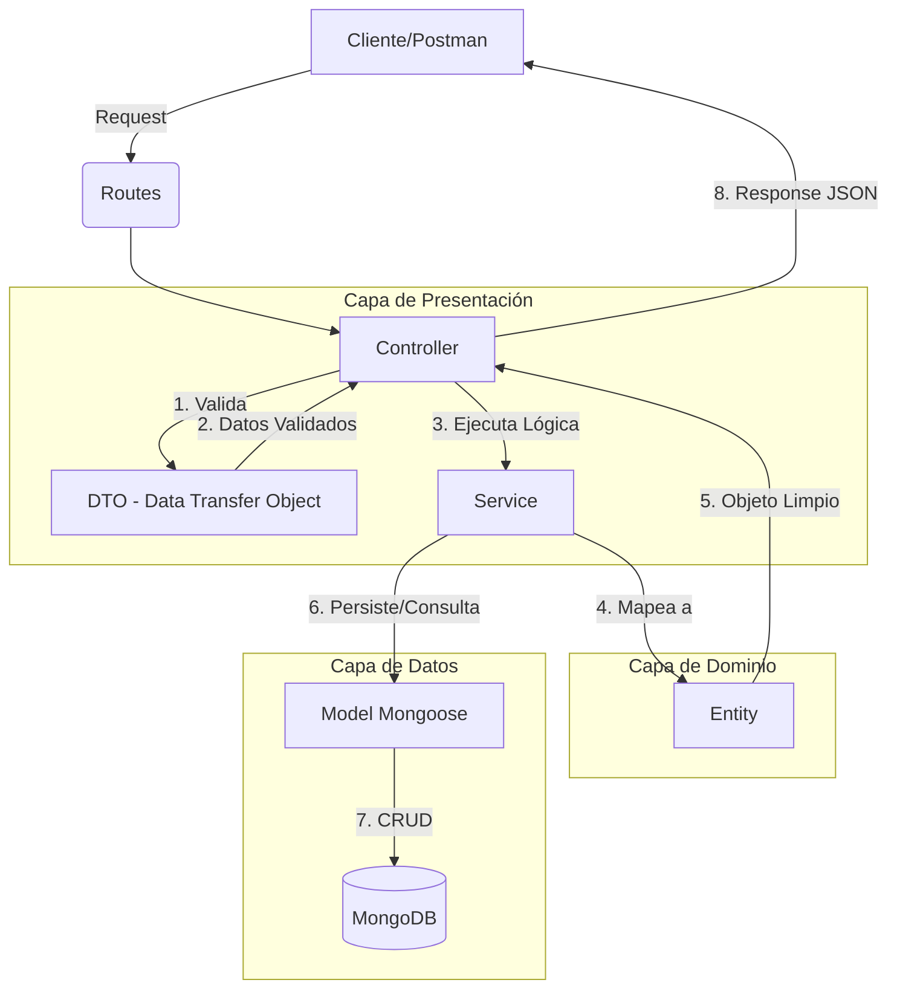

# 🚀 Flujo de Arquitectura: User Store Project

Este documento describe el flujo de datos y la arquitectura implementada en el proyecto `user-store`, basado en los principios de **Clean Architecture**.

## 🗺️ Diagrama de Flujo General

---

## 🛠️ Componentes y Responsabilidades

### 1. DTO (Data Transfer Object)
**Ubicación:** `src/domain/dtos`
- **Función:** Validar la entrada de datos.
- **Responsabilidad:** Asegurar que el `req.body` contenga los campos requeridos y que tengan el formato correcto (ej. emails válidos, longitud de contraseña).
- **Resultado:** Si los datos son inválidos, detiene el flujo inmediatamente con un error.

### 2. Controller
**Ubicación:** `src/presentation/auth` o `src/presentation/category`
- **Función:** Orquestador de la petición.
- **Responsabilidad:** 
    - Recibir la petición HTTP.
    - Instanciar el DTO para validar.
    - Llamar al servicio correspondiente.
    - Manejar la respuesta (estatus HTTP y cuerpo JSON).

### 3. Service
**Ubicación:** `src/presentation/services`
- **Función:** Lógica de Negocio (The Brain).
- **Responsabilidad:** 
    - Coordinar la operación (ej. registrar usuario $\rightarrow$ encriptar password $\rightarrow$ guardar $\rightarrow$ generar token $\rightarrow$ enviar email).
    - Interactuar con la capa de datos.
    - Lanzar errores de negocio personalizados (`CustomError`).

### 4. Model
**Ubicación:** `src/data/models`
- **Función:** Interfaz de Base de Datos.
- **Responsabilidad:** Definir el esquema de MongoDB y proporcionar los métodos de acceso a los datos (findOne, save, etc.).

### 5. Entity
**Ubicación:** `src/domain/entities`
- **Función:** Representación pura del negocio.
- **Responsabilidad:** Actuar como un filtro de seguridad y normalización. Convierte un documento "sucio" de la base de datos (que puede incluir campos internos de Mongo o contraseñas) en un objeto limpio para ser enviado al cliente.

---

## 🔄 Ejemplo de Ciclo de Vida: `registerUser`

1. **Entrada:** El cliente envía un JSON con nombre, email y contraseña.
2. **Validación:** El `AuthContrloller` usa `RegisterUserDto.create()`. Si el email no es válido, devuelve `400 Bad Request`.
3. **Lógica:** El `AuthService` recibe el DTO:
    - Busca en `UserModel` si el email existe.
    - Usa `bcryptAdapter` para hashear la contraseña.
    - Guarda el usuario mediante `UserModel.save()`.
    - Genera un token con `JwtAdapter`.
4. **Limpieza:** El servicio llama a `UserEntity.fromObject(user)` para eliminar la contraseña del objeto.
5. **Salida:** El controlador envía al cliente el objeto `UserEntity` + el `token` con un estado `200 OK`.
